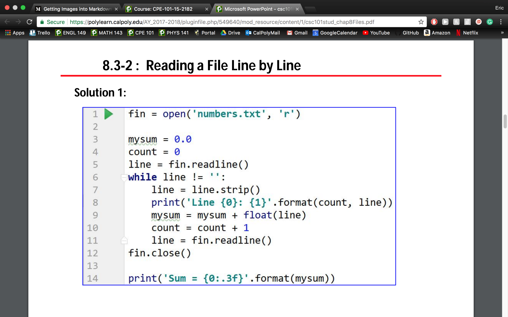

# I/O Continued:
## 8.1: I/O Files: What is a file?
* A file is a sequence of bytes that belong together
* A file contains 8 bits (0, 1)
* files are managed by the OS
* the OS stores the name, location, timestamp
* Different Types of Files: text files and binary files
### The file type determines how the byte is interpreted.

### How ASCII Files are interpreted:
* each byte of the file corresponds to one character of the ASCII-code: 01000001 => 65 => 'A'
* a new line is stored using one or two bytes depends on the OS and the editor

### to summarize: a file is a sequence of bytes

## 8.2: Read/Write a file
### 3 STEPS:
1) Open a file
* open returns a file object
* provide filename, access-mode: 'r' (read) or 'w' (write) or 'a' (append)
* filetype: ASCII-file(text file) or binary file

2) Read/write data using a method of the object file

for a text file:
* to write 'A', a byte containing the number 65, 0x41 is written to the file
* if 01000001 is read, the read function return 'A'

3) at the end, the file must be closed

      fobj = open(filename, 'r')
      fobj.read()
      fobj.write()

      fobj.close()

## 8.3: Reading a file line by line
Instead of reading single characters, it is often much simpler to read a file line by line
* method: readline() => returns one line as a string

If readline() returns an empty string, then the empty string has been reached

### 3 STEP SOLUTION:
1) open: filename, mode: 'r'
* bytes are interpretted using the ASCII code by default
      fin = open('numbers.txt', 'r')

2) read lines
* number of line is unknown
* end of file; readline returns an empty string
* an empty line does not return an empty string, it returns '\r\lf'
* strip() removes whitespace

3) close

### for loop
      for line in fin:
* iterates over all lines of a file
* similar to "for item in list"

## 8.4: Writing to a file
open:
* use write access: 'w'
* characters are stored using the ASCII code
* the old content of the file is deleted

      fout.write(string + '\n') => print(string)
      write(string) => print(string, end='')

## 8.5: Splitting Lines
Algorithm:
* Read line by line
* analyze the line using method split

### Method split:
splits a string into parts and __returns a list__ containing all parts
